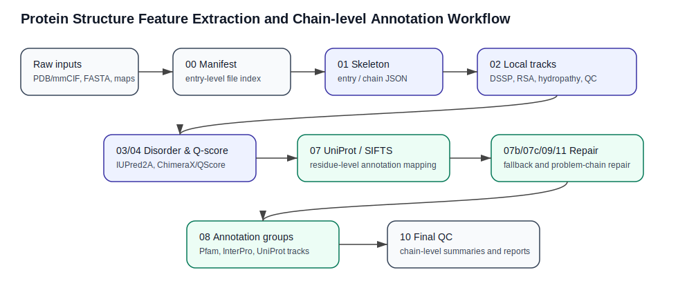

# Protein Structure Feature and Chain-level Annotation Pipeline

A reproducible Python/Linux pipeline for protein structure feature extraction, chain-level annotation, UniProt/SIFTS mapping, quality control, problem-chain repair, and Slurm/HPC batch processing.

This repository organizes a practical structural bioinformatics workflow originally developed for protein structure database curation tasks. The workflow converts raw structure and sequence resources into chain-level JSON records, computes local structural and sequence features, maps chains to UniProt/SIFTS annotations, builds annotation groups, repairs problematic chain mappings, and produces final QC summaries.

## Core capabilities

- Manifest construction and FASTA path matching
- Chain-level and residue-level JSON skeleton generation from PDB/mmCIF files
- Local feature calculation including secondary structure, RSA/buried residues, hydropathy, approximate clash checks, bond outlier checks, and cis-peptide detection
- Disorder feature integration through optional IUPred2A
- Q-score integration through optional ChimeraX/QScore output parsing
- Sequence feature QC for local structural tracks
- UniProt/SIFTS annotation mapping
- Alignment-based UniProt mapping fallback
- Auxiliary-file-guided mapping repair using `.toRCSB`, FASTA, FAA, and CIF hints
- Annotation group construction for Pfam, InterPro, UniProt features, and SIFTS-derived features
- Final chain-level QC summaries and problem-chain reports
- Slurm templates for HPC array jobs

## Repository layout

```text
configs/          Example YAML configuration files
scripts/          Executable Python scripts for each pipeline stage
slurm/            Portable Slurm job templates
src/psfp/         Reserved package namespace for future reusable modules
docs/             Pipeline, data schema, QC and report documentation
example_data/     Small public or synthetic demo inputs
example_outputs/  Expected output folders and demo output locations
tests/            Reserved for unit tests
notebooks/        Reserved for result visualization notebooks
```

## Pipeline overview

```mermaid
flowchart LR
    A[Raw inputs: PDB/mmCIF, FASTA, maps] --> B[00 Manifest construction]
    B --> C[01 Chain-level JSON skeleton]
    C --> D[02 Local structural tracks]
    D --> E[03/04 Disorder and Q-score]
    E --> F[07 UniProt/SIFTS mapping]
    F --> G[07b/07c/09/11 Mapping fallback and repair]
    G --> H[08 Annotation groups]
    H --> I[10 Final chain-level QC]
```





## Installation

```bash
conda env create -f environment.yml
conda activate protein-structure-pipeline
```

Or use pip:

```bash
python -m venv .venv
source .venv/bin/activate
pip install -r requirements.txt
```

Optional external tools:

- `mkdssp` for DSSP secondary-structure assignment
- `freesasa` command-line tool or Python package for solvent-accessible surface area, depending on local setup
- `IUPred2A` for sequence-based disorder prediction
- `ChimeraX` with QScore support for cryo-EM map/model validation features

The pipeline is designed to skip or mark optional features when the corresponding external tool is unavailable.

## Main scripts

| Stage | Script | Purpose |
|---|---|---|
| 00 | `00_build_manifest.py` | Add FASTA paths to an existing manifest |
| 01 | `01_build_skeleton.py` | Build entry and chain JSON skeletons |
| 02 | `02_compute_local_tracks.py` | Compute local structural and sequence tracks |
| 03 | `03_compute_disorder_qscore.py` | Add disorder and Q-score features |
| 04 | `04_reparse_qscore_raw.py` | Reparse saved ChimeraX QScore raw outputs |
| 05 | `05_qc_sequence_features.py` | QC local sequence/structure features |
| 07 | `07_sifts_uniprot_annotations.py` | Direct SIFTS and UniProt annotation mapping |
| 07b | `07b_sifts_alignment_fallback.py` | Alignment-based fallback for weak SIFTS mapping |
| 07c | `07c_aux_guided_uniprot_mapping.py` | Auxiliary-file-guided UniProt mapping |
| 08 | `08_build_annotation_groups.py` | Build annotation-group tracks |
| 09 | `09_repair_problem_chains_aux.py` | Repair problem chains using auxiliary files |
| 10 | `10_qc_all_chain_json.py` | Final all-chain QC summary |
| 11 | `11_torcsb_guided_mapping_repair.py` | Repair mappings using `.toRCSB` chain correspondence |

## Included small-scale demo data

This repository includes a lightweight synthetic demo dataset so that the project can be inspected without downloading a full structure database. The demo data are intentionally small and are designed to exercise the main data model rather than reproduce production-scale results.

```text
example_data/manifest/demo_manifest.csv        Demo structure manifest
example_data/raw/mmcif/demo_1abc.pdb           Synthetic PDB-like structure with two chains
example_data/raw/mmcif/demo_2xyz.pdb           Synthetic PDB-like structure with a modified residue
example_data/raw/fasta/demo_1abc.fasta         Demo FASTA records
example_data/raw/fasta/demo_2xyz.fasta         Demo FASTA records
example_data/raw/sifts/demo_sifts_mapping.tsv  SIFTS-like chain-to-UniProt mapping table
example_data/raw/qscore/demo_qscore.csv        Demo Q-score summary table
```

The `example_outputs/` directory contains generated chain JSON files, local-track summaries, annotation tables, and final QC reports from the synthetic demo.

## Example commands

Build chain skeletons:

```bash
python scripts/01_build_skeleton.py \
  --manifest example_data/manifest/demo_manifest.csv \
  --out-dir example_outputs/json \
  --manifest-out example_outputs/manifest/manifest_skeleton.csv \
  --overwrite
```

Compute local tracks:

```bash
python scripts/02_compute_local_tracks.py \
  --manifest example_outputs/manifest/manifest_skeleton.csv \
  --json-root example_outputs/json \
  --manifest-out example_outputs/manifest/manifest_local_tracks_batch0.csv \
  --batch-size 3000 \
  --batch-index 0
```

Run SIFTS/UniProt annotation mapping:

```bash
python scripts/07_sifts_uniprot_annotations.py \
  --manifest example_outputs/manifest/manifest_skeleton.csv \
  --json-root example_outputs/json \
  --cache-dir .cache/sifts_uniprot \
  --summary-out example_outputs/qc/sifts_uniprot_annotation_summary.csv
```


Run the synthetic demo feature/annotation population step:

```bash
python scripts/demo_populate_synthetic_features.py \
  --json-root example_outputs/json
```

Then run final QC:

```bash
python scripts/10_qc_all_chain_json.py \
  --json-root example_outputs/json \
  --manifest example_outputs/manifest/manifest_skeleton.csv \
  --summary-out example_outputs/qc/all_chain_qc_summary.csv \
  --problem-out example_outputs/qc/all_chain_qc_problem_chains.csv \
  --annotation-problem-out example_outputs/qc/annotation_problem_chains.csv \
  --local-problem-out example_outputs/qc/local_parameter_problem_chains.csv
```

## Slurm/HPC usage

Portable Slurm templates are available under `slurm/`. Example:

```bash
PROJECT_ROOT=$PWD PYTHON=$(which python) sbatch slurm/run_local_tracks_array.slurm
```

The Slurm files use environment variables such as `PROJECT_ROOT`, `PYTHON`, `IUPRED_CMD`, and `CHIMERAX_CMD`, so they can be adapted to different clusters without hard-coded server paths.

## Data scope

The repository is intended as a public, reproducible demonstration of a structural bioinformatics workflow. Example folders are provided for small public or synthetic inputs and outputs. Large production outputs, local logs, raw internal caches, and private scratch directories are excluded by `.gitignore`.

## Technical Scope

This repository focuses on practical protein structure data processing at the chain and residue levels. It covers structure parsing, feature extraction, UniProt/SIFTS-based annotation mapping, problem-chain detection, quality-control reporting, and Slurm-based batch execution.

The workflow is designed to demonstrate how raw structure and sequence resources can be converted into structured, reproducible, and inspection-ready outputs for downstream structural bioinformatics analysis.
